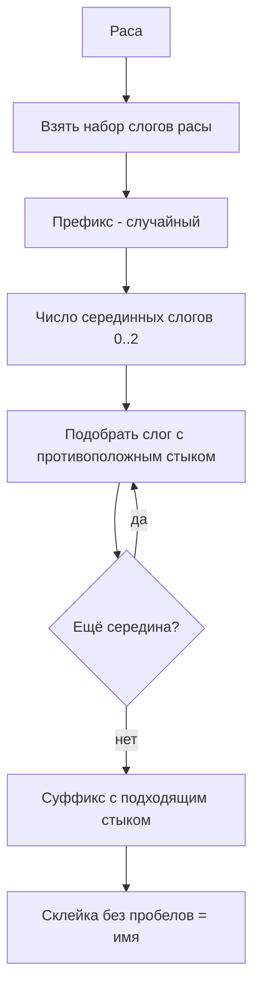
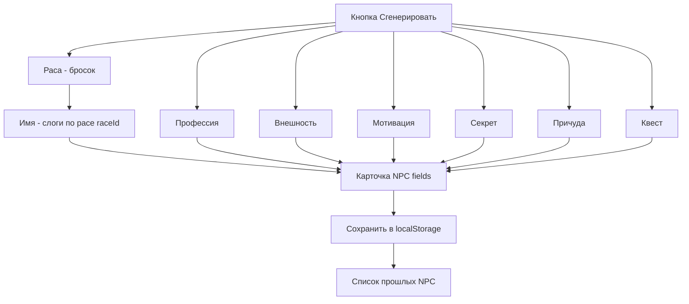

# Архитектура генератора NPC (spark tables)

## Цель

Генератор NPC для НРИ на основе spark-таблиц. Одна кнопка **«Сгенерировать»** создаёт цельного персонажа со всеми признаками (включая квест как одно из полей). Все сгенерированные персонажи сохраняются в истории браузера (`localStorage`).

Страница: `/tools/npc` (карточка-ссылка уже есть в `/tools`).

---

## Ключевые решения

1. **Свой движок без внешних библиотек.** Готовые движки (Perchance, Tracery, rolltable) решают только тривиальный бросок по таблице, но НЕ решают две главные задачи: русское согласование прилагательных по роду и слоговую сборку имён. Своя реализация ~150 строк чистого TS, ноль зависимостей — совместимо с `output: export` и GitHub Pages.
2. **Согласование родов — подход B (все формы в данных).** Прилагательное хранит сразу 4 формы (masc/neut/fem/plur), существительное указывает свой род, движок выбирает нужную форму. 100% корректность, нулевая логика морфологии.
3. **Каждый столбец таблицы бросается независимо** — максимум комбинаторики.
4. **NPC = набор полей-блоков.** Квест — одно из полей персонажа (его текущее дело), а не отдельная страница.
5. **Имена собираются из слогов**, набор слогов зависит от расы; раса бросается первой, имя генерируется под неё. Слоги помечены гласный/согласный для красивых стыков. Длина имени случайная.
6. **История в localStorage**, переживает перезагрузку. Это требует клиентского компонента (`"use client"`).

---

## Модель данных

### Род и формы прилагательных

```ts
type Gender = "masc" | "neut" | "fem" | "plur";
type AdjForms = Record<Gender, string>; // { masc, neut, fem, plur }
```

### Spark-таблица

Таблица = набор столбцов. Каждый столбец бросается независимо. Результаты склеиваются по `template`.

```ts
type SparkColumn =
  | { role: "adjective"; die: number; rows: AdjForms[] }
  | { role: "noun"; die: number; rows: { text: string; gender: Gender }[] }
  | { role: "plain"; die: number; rows: { text: string }[] };

interface SparkTable {
  id: string;
  title: string;
  template: string;   // например "{0} {1}" или "{0} {1}, {2}. Твист: {3}"
  agreeWith?: number; // индекс noun-столбца, задающего род для adjective-столбцов
  columns: SparkColumn[];
}
```

Пример таблицы внешности (согласование внутри таблицы):

```jsonc
{
  "id": "npc-appearance",
  "title": "Внешность",
  "template": "{0} {1}",
  "agreeWith": 1,
  "columns": [
    {
      "role": "adjective",
      "die": 6,
      "rows": [
        { "masc": "крючковатый", "neut": "крючковатое", "fem": "крючковатая", "plur": "крючковатые" },
        { "masc": "выцветший",   "neut": "выцветшее",   "fem": "выцветшая",   "plur": "выцветшие" }
      ]
    },
    {
      "role": "noun",
      "die": 6,
      "rows": [
        { "text": "нос",   "gender": "masc" },
        { "text": "лицо",  "gender": "neut" },
        { "text": "борода","gender": "fem" },
        { "text": "глаза", "gender": "plur" }
      ]
    }
  ]
}
```

Пример таблицы квеста (4 столбца):

```jsonc
{
  "id": "quest",
  "title": "Квест",
  "template": "{0} {1}, {2}. Твист: {3}",
  "columns": [
    { "role": "plain", "die": 8, "rows": [ { "text": "доставить" }, { "text": "найти" } ] },
    { "role": "plain", "die": 8, "rows": [ { "text": "реликвию" }, { "text": "послание" } ] },
    { "role": "plain", "die": 8, "rows": [ { "text": "но за ней охотятся другие" } ] },
    { "role": "plain", "die": 8, "rows": [ { "text": "заказчик лжёт о цели" } ] }
  ]
}
```

### Слоговый генератор имён

```ts
type Onset = "v" | "c"; // гласный / согласный (для стыков)

interface Syllable {
  text: string;
  startsWith?: Onset; // тип первого звука (для middle/suffix)
  endsWith?: Onset;   // тип последнего звука (для prefix/middle)
}

interface RaceNameSet {
  prefix: Syllable[];
  middle: Syllable[];
  suffix: Syllable[];
}

type NameData = Record<string /* raceId */, RaceNameSet>;
```

Пример `names.json`:

```jsonc
{
  "elf": {
    "prefix": [ { "text": "Гвен", "endsWith": "c" }, { "text": "Аэ", "endsWith": "v" } ],
    "middle": [ { "text": "до", "startsWith": "c", "endsWith": "v" }, { "text": "эль", "startsWith": "v", "endsWith": "c" } ],
    "suffix": [ { "text": "лин", "startsWith": "c" }, { "text": "иэль", "startsWith": "v" } ]
  }
}
```

Раса в таблице `npc-race` должна иметь `raceId`, совпадающий с ключом в `names.json`.

### Модель сгенерированного NPC

```ts
interface NpcField { label: string; value: string }

interface Npc {
  id: string;        // timestamp/uuid
  createdAt: number;
  fields: NpcField[]; // Имя, Раса, Профессия, Внешность, Мотивация, Секрет, Причуда, Квест
}
```

---

## Алгоритмы

### Бросок по таблице → строка

1. Для каждого столбца — бросок `die`, выбор строки.
2. Определить ведущий род: если есть `agreeWith`, взять `gender` из выбранной строки этого noun-столбца; иначе `masc`.
3. Для adjective-столбцов взять форму `forms[gender]`; для noun/plain — `text`.
4. Подставить значения по индексам в `template`.
5. Первую букву результата — в верхний регистр.

### Слоговый генератор имён `generateName(raceId)`



Правило стыка: следующий слог начинается с типа, противоположного концу предыдущего (`c`↔`v`). Если подходящих нет — фолбэк на любой слог.

### Сборка NPC `generateNpc()`



Порядок: сначала раса (даёт `raceId`), затем имя под расу, затем остальные независимые поля и квест.

---

## Список полей карточки (`fields.ts`)

| Поле | Источник | Согласование |
|---|---|---|
| Имя | слоговый генератор по расе | — |
| Раса | `npc-race` | — |
| Профессия | `npc-profession` | — |
| Внешность | `npc-appearance` | внутри таблицы (прил.+сущ.) |
| Мотивация | `npc-motivation` | — |
| Секрет | `npc-secret` | — |
| Причуда | `npc-quirk` | — |
| Квест | `quest` (4 столбца) | — |

---

## Структура файлов

```
app/
  tools/npc/page.tsx              ← re-export из modules/npc (уже есть)
  data/spark/
    tables/
      npc-race.json
      npc-profession.json
      npc-appearance.json
      npc-motivation.json
      npc-secret.json
      npc-quirk.json
      quest.json
    names.json

modules/npc/
  NpcPage.tsx                     ← server: export metadata + рендер NpcGenerator
  components/
    NpcGenerator.tsx              ← "use client": кнопка, состояние, история
    NpcCard.tsx                   ← одна карточка персонажа
    NpcField.tsx                  ← строка метка: значение
  lib/
    types.ts
    roll.ts                       ← rollDie, pickRow
    agreement.ts                  ← форма прилагательного по роду
    generateTable.ts              ← таблица -> строка
    generateName.ts               ← слоги -> имя по расе
    generateNpc.ts                ← собрать целого NPC
    fields.ts                     ← список полей карточки
    storage.ts                    ← localStorage история

plans/
  npc-generator-architecture.md   ← этот документ
```

---

## Замечания по интеграции с проектом (MEMORY.md)

- `NpcPage.tsx` остаётся серверным: экспортирует `metadata` и рендерит клиентский `NpcGenerator`.
- `NpcGenerator.tsx` — **первый `"use client"` компонент в проекте** (кнопка, состояние, localStorage). Совместимо с `output: export`.
- Палитра — только токены `pumpkin-*`.
- Данные таблиц — в `app/data/spark/` рядом с существующим `app/data/`.
- Импорт JSON статический (через `resolveJsonModule` в tsconfig — проверить, что включено).
- Не пушить в репозиторий — пуш делает пользователь.

---

## Открытые вопросы на потом (не блокируют старт)

- Согласование слов с полом NPC (травник/травница) — отложено.
- Действия над карточкой: копировать, удалить одну, очистить историю.
- Помеха/преимущество на броски, фиксация конкретных значений (lock поля).
- Расширение наборов слогов и таблиц.
